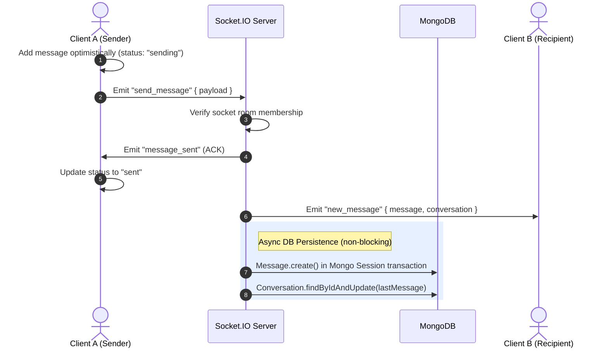
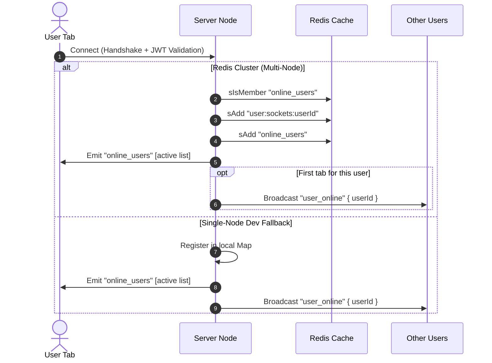
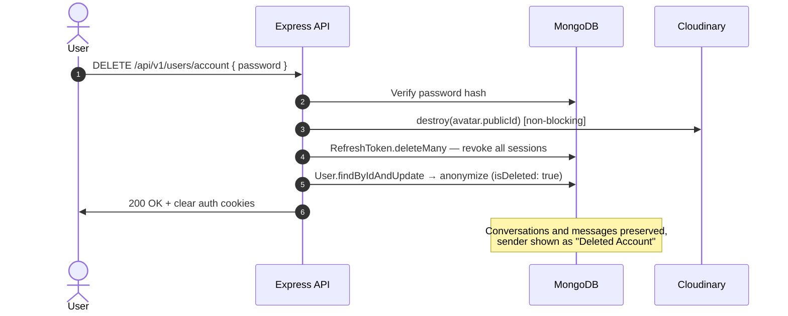
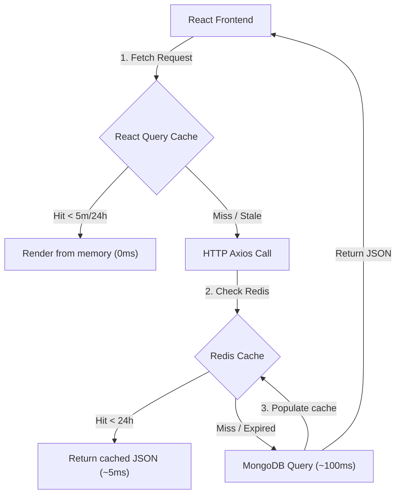
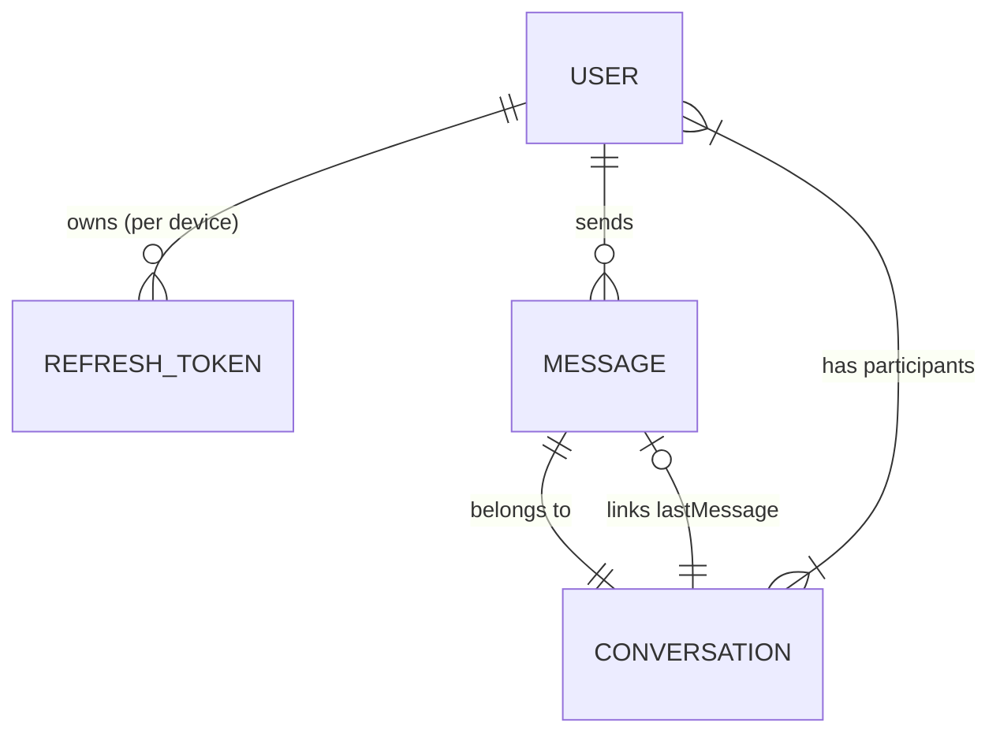

# 🌐 Rynqor — Real-time MERN Chat Application

Rynqor is a high-performance, real-time MERN chat application built with **React 19**, **Express 5**, **MongoDB**, **Redis**, and **Socket.IO**. Designed with an optimistic-first UI, it supports instantaneous messaging, group and direct conversations, live typing indicators, read receipts, media attachments, user presence tracking, session management, and Instagram-style soft account deletion.

---

## 🚀 Key System Features

- **Optimistic-First Messaging** — Messages appear instantly with live status indicators (`sending → sent → read`) and automatic rollback on failure.
- **Group & Direct Conversations** — Create direct chats, self-note chats, and named group conversations with admin roles.
- **Horizontal Scaling with Redis** — Socket.IO Redis Adapter scales WebSocket connections across multiple server nodes with multi-tab presence tracking.
- **Atomic DB Transactions** — MongoDB sessions/transactions guarantee referential integrity when writing messages and updating conversation activity pointers.
- **Hybrid Caching Architecture** — Combines a 24-hour server-side Redis cache with event-driven invalidation (cleared on profile updates or new media uploads) and client-side TanStack Query stale-time tuning. Includes **dynamic self-healing fail-safes** that automatically bypass Redis and fallback to MongoDB and local memory maps if the cache server goes offline at runtime.
- **Silent JWT Rotation** — HTTP-Only cookie-based auth with automatic access-token refresh loops; zero user interruption.
- **Session Management** — Per-device refresh token tracking with remote logout support. Password change force-revokes all active sessions.
- **Email Verification** — OTP-based email verification via Resend (togglable per environment). Unverified accounts auto-expire via MongoDB TTL index.
- **Forgot/Reset Password** — Secure 6-digit OTP flow; resets revoke all active sessions.
- **Instagram-Style Soft Delete** — Deleted accounts are anonymized (name → "Deleted Account", placeholder email/username), sessions revoked, avatar removed. Conversation history is preserved for other participants. Deleted accounts cannot log in and are hidden from search.
- **Virtualized Message Feeds** — Infinite-scroll message history via `react-virtuoso` with no DOM bottlenecks.
- **Direct Cloud Media Uploads** — Upload images, video, audio, and files directly to Cloudinary using cryptographic signatures generated by the Express server, completely bypassing backend memory/disk buffering and eliminating server-side I/O bottlenecks. Custom validators enforce per-type size and MIME boundaries.
- **System Messages** — Server-emitted notices rendered as pill labels (e.g. group events).
- **Zero-Flicker Theming** — Dark/light mode hydrated before React mounts, synced to system preference.

---

## 🛠️ Technology Stack

### Frontend
| Library | Version | Role |
|---|---|---|
| React | 19.x | UI framework (Concurrent Rendering) |
| Vite | 8.x | Build engine (ESM-only dev server) |
| Tailwind CSS | v4.x | Utility-first native CSS |
| TanStack Query | v5.x | Server cache, optimistic mutations |
| Socket.IO Client | v4.8 | Real-time WebSocket client |
| React Virtuoso | v4.x | Virtualized message list |
| React Router | v7.x | Client-side routing |

### Backend
| Library | Version | Role |
|---|---|---|
| Express | v5.x | HTTP server (native async handlers) |
| Mongoose | v9.x | MongoDB ODM with strict schemas |
| Socket.IO | v4.8 | WebSocket server |
| Redis / `@socket.io/redis-adapter` | v6.x | Multi-node presence scaling |
| Cloudinary SDK | v2.x | Media storage and delivery |
| Zod | v4.x | Runtime request validation |
| bcryptjs | — | Password hashing |
| Multer | — | Multipart file handling |
| Resend | — | Transactional email (OTP) |

---

## 📂 Codebase Architecture

```text
Rynqor/
├── client/                        # React Frontend
│   └── src/
│       ├── components/
│       │   ├── app/               # SplashScreen, GlobalErrorBoundary
│       │   ├── chat/              # ChatHeader, ChatItem, Message, MessageInput,
│       │   │                      #   MessageList, MessageMedia, TypingIndicator,
│       │   │                      #   CreateGroupModal, ScrollToBottomButton
│       │   ├── common/            # Skeleton loaders, ErrorBoundary, LazyPage
│       │   ├── navigation/        # Sidebar / nav components
│       │   └── search/            # User search UI
│       ├── constants/             # Upload limits, MIME types
│       ├── context/               # ThemeContext
│       ├── hooks/
│       │   ├── auth/              # useCurrentUserQuery, useLoginMutation,
│       │   │                      #   useLogoutMutation, useSessionsQuery, ...
│       │   ├── chat/              # useChatMessages, useChatScroll, useReadReceipts
│       │   ├── conversations/     # useConversationByIdQuery, useConversationsQuery, ...
│       │   ├── messages/          # useUploadMessageMediaMutation
│       │   └── users/             # useUserQuery, useUpdateProfileMutation,
│       │                          #   useChangePasswordMutation, useDeleteAccountMutation, ...
│       ├── layouts/               # AppLayout, ChatLayout, AuthLayout
│       ├── pages/
│       │   ├── auth/              # Login, Signup, ForgotPassword, VerifyEmail
│       │   ├── chat/              # ChatsPage, ConversationPage
│       │   ├── profile/           # ProfilePage, UserProfilePage, GroupProfilePage
│       │   └── search/            # SearchPage
│       ├── routes/                # ProtectedRoute, PublicRoute
│       └── services/
│           ├── api.js             # Axios instance with refresh interceptor
│           ├── authService.js
│           ├── userService.js
│           ├── conversationService.js
│           ├── messageService.js
│           └── socket/            # SocketProvider, useSocket, cache update helpers
│
└── server/                        # Express + Socket.IO Backend
    └── src/
        ├── config/                # DB, Redis, env config
        ├── constants/             # Shared server constants
        ├── controllers/           # auth, user, conversation, message
        ├── middleware/            # verifyJwt, validate (Zod), multer upload,
        │                          #   rateLimiter, cache, handleSingleUpload
        ├── models/                # User, RefreshToken, Conversation, Message
        ├── routes/                # auth, user, conversation, message
        ├── schemas/               # Zod schemas for all endpoints
        ├── services/              # Business logic (auth, user, conversation,
        │                          #   message, email)
        ├── socket/                # Socket connection handlers, presence engine
        └── utils/                 # ApiError, ApiResponse, generateTokens,
                                   #   cloudinary, getDeviceInfo, format
```

---

## ⚡ System Event Flows

### 1. Send Message (Optimistic + Async Persistence)



### 2. Multi-Tab Presence Synchronization



### 3. Account Deletion (Soft Delete)



### 4. Hybrid Caching Architecture



---

## 📊 Database Models



### User
```js
{
  username:               String,   // unique, 3-30 chars, alphanumeric + underscore
  fullName:               String,   // required
  email:                  String,   // unique, lowercase
  password:               String,   // bcrypt hashed, select: false
  avatar:                 { url: String, publicId: String } | null,
  bio:                    String,   // max 160 chars
  isVerified:             Boolean,  // email verification gate
  isDeleted:              Boolean,  // soft-delete flag (Instagram-style)
  verificationOtp:        String,   // 6-digit crypto OTP
  verificationOtpExpires: Date,     // MongoDB TTL auto-purges unverified users
  resetOtp:               String,
  resetOtpExpires:        Date,
  lastSeen:               Date,
}
```

### RefreshToken
```js
{
  user:       ObjectId,  // ref: User
  token:      String,    // SHA-256 hashed
  device:     String,
  location:   String,
  ipAddress:  String,
  userAgent:  String,
  lastUsedAt: Date,
  expiresAt:  Date,      // MongoDB TTL index (30 days)
}
```

### Conversation
```js
{
  participants: [ObjectId],  // ref: User — compound index with updatedAt
  type:         "direct" | "self" | "group",
  name:         String,      // group display name
  avatar:       { url: String, publicId: String },
  admins:       [ObjectId],  // ref: User — group admins
  lastMessage:  ObjectId,    // ref: Message
}
```

### Message
```js
{
  conversationId: ObjectId,  // ref: Conversation — compound index with _id desc
  senderId:       ObjectId,  // ref: User
  text:           String,
  messageType:    "text" | "media" | "mixed" | "system",
  media: [{
    url:       String,
    publicId:  String,
    type:      "image" | "video" | "audio" | "file",
    name:      String,
    size:      Number,
  }],
  status: "sent" | "read",
}
```

---

## 🔌 API Reference

### Auth — `/api/v1/auth`
| Method | Route | Auth | Description |
|---|---|---|---|
| `POST` | `/register` | — | Register new account |
| `POST` | `/login` | — | Login, sets HttpOnly cookies |
| `POST` | `/verify-email` | — | Verify email OTP |
| `POST` | `/resend-verification` | — | Resend verification OTP |
| `GET` | `/check-username` | — | Check username availability (rate-limited: 30 req/min) |
| `POST` | `/forgot-password` | — | Send password-reset OTP |
| `POST` | `/reset-password` | — | Reset password + revoke all sessions |
| `POST` | `/refresh-token` | — | Rotate access/refresh token pair |
| `GET` | `/current-user` | ✅ | Get authenticated user profile |
| `POST` | `/logout` | ✅ | Logout current session |
| `GET` | `/sessions` | ✅ | List all active device sessions |
| `POST` | `/logout-session/:sessionId` | ✅ | Remote logout a specific session |

### Users — `/api/v1/users`
| Method | Route | Auth | Description |
|---|---|---|---|
| `GET` | `/search?search=` | ✅ | Search users by name or username |
| `PATCH` | `/profile` | ✅ | Update fullName / username / bio |
| `PATCH` | `/avatar` | ✅ | Upload new avatar |
| `DELETE` | `/avatar` | ✅ | Remove current avatar |
| `PATCH` | `/change-password` | ✅ | Change password + revoke all sessions |
| `DELETE` | `/account` | ✅ | Soft-delete account (password confirm) |
| `GET` | `/:id` | ✅ | Get public user profile (Redis-cached, 24h TTL) |

### Conversations — `/api/v1/conversations`
| Method | Route | Auth | Description |
|---|---|---|---|
| `GET` | `/` | ✅ | List all conversations |
| `POST` | `/` | ✅ | Create direct or self conversation |
| `GET` | `/:id` | ✅ | Get single conversation |
| `POST` | `/group` | ✅ | Create group conversation |
| `PATCH` | `/group/:id` | ✅ | Update group info |
| `DELETE` | `/:id` | ✅ | Delete conversation |
| `GET` | `/:conversationId/media` | ✅ | Get conversation shared media (Redis-cached, 24h TTL) |

### Messages — `/api/v1/messages`
| Method | Route | Auth | Description |
|---|---|---|---|
| `GET` | `/:conversationId` | ✅ | Paginated message history |
| `GET` | `/upload-signature` | ✅ | Get secure Cloudinary upload signature |

---

## 🌐 Socket.IO Events

| Direction | Event | Payload |
|---|---|---|
| Client → Server | `send_message` | `{ conversationId, text, media, clientTempId }` |
| Client → Server | `join_conversation` | `conversationId` |
| Client → Server | `typing` | `conversationId` |
| Client → Server | `stop_typing` | `conversationId` |
| Client → Server | `mark_read` | `{ conversationId, messageIds }` |
| Server → Client | `new_message` | `{ message, conversation }` |
| Server → Client | `message_sent` | `{ clientTempId, message }` |
| Server → Client | `messages_read` | `{ conversationId, messageIds }` |
| Server → Client | `user_typing` | `{ userId, conversationId }` |
| Server → Client | `user_stop_typing` | `{ userId, conversationId }` |
| Server → Client | `user_online` | `{ userId }` |
| Server → Client | `user_offline` | `{ userId, lastSeen }` |
| Server → Client | `online_users` | `string[]` |

---

## 🔒 Security Highlights

- **HttpOnly Cookies** — Access, refresh, and session tokens are never accessible to JavaScript.
- **Rate Limiting** — Auth and upload routes are protected by per-IP rate limiters. The public `/check-username` endpoint has a dedicated limiter (30 req/min) to block username enumeration by scrapers.
- **Force Logout on Password Change** — All active sessions across all devices are revoked on password change or reset.
- **Soft Delete Guard** — Deleted accounts cannot log in and are excluded from all search results.
- **Zod Validation** — Every request body, query, and param is validated against strict schemas before reaching controllers.
- **JWT Verification on Socket** — WebSocket handshake validates the access token; unauthenticated connections are rejected immediately.
- **MongoDB TTL Index** — Unverified users are automatically purged after their OTP expires; no manual cleanup needed.

---

## 🛠️ Environment Variables

Create a `.env` file in the `/server` directory:

```env
PORT=8000
CLIENT_URL=http://localhost:5173
NODE_ENV=development

MONGODB_URL=mongodb+srv://<user>:<password>@cluster.mongodb.net
DB_NAME=rynqor-chat

ACCESS_TOKEN_SECRET=your_jwt_access_secret_key
ACCESS_TOKEN_EXPIRY=15m

REFRESH_TOKEN_SECRET=your_jwt_refresh_secret_key
REFRESH_TOKEN_EXPIRY=30d

CLOUDINARY_CLOUD_NAME=your_cloudinary_name
CLOUDINARY_API_KEY=your_cloudinary_api_key
CLOUDINARY_API_SECRET=your_cloudinary_api_secret

# Optional: Redis for presence tracking and Socket.IO horizontal scaling
REDIS_URL=redis://localhost:6379

# Optional: Email (Resend) — set to true to enforce OTP verification on signup
RESEND_API_KEY=re_your_resend_api_key
SMTP_FROM=Rynqor <noreply@yourdomain.com>
EMAIL_VERIFICATION_REQUIRED=false
```

---

## 💻 Local Development

### 1. Install Dependencies
```bash
cd server && npm install
cd ../client && npm install
```

### 2. Start Development Servers

**Backend:**
```bash
cd server
npm run dev
```

**Frontend:**
```bash
cd client
npm run dev
```

### 3. Ports
| Service | URL |
|---|---|
| Frontend | `http://localhost:5173` |
| Backend API | `http://localhost:8000` |
| API namespace | `http://localhost:8000/api/v1` |
