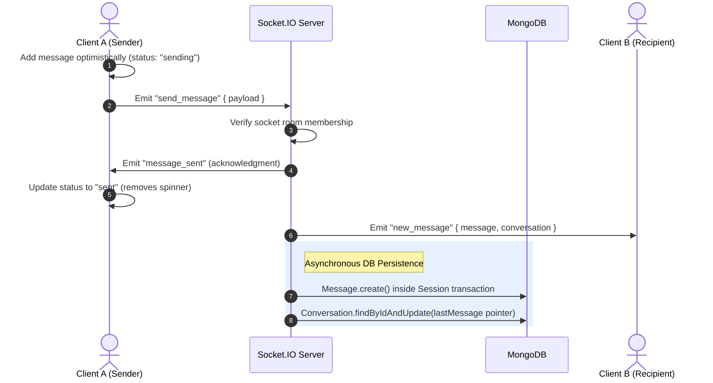
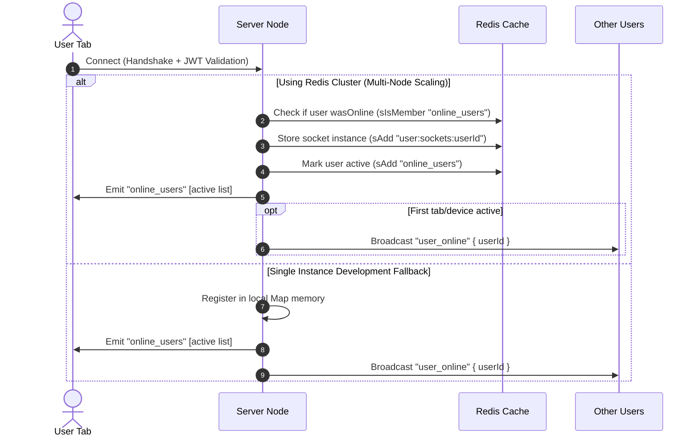
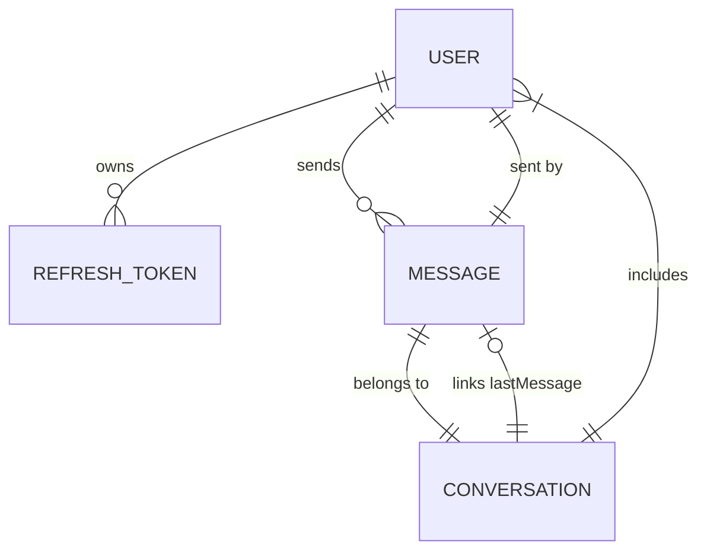

# 🌐 Rynqor — Real-time MERN Chat Application

Rynqor is a high-performance, real-time MERN chat application built with **React 19**, **Express 5**, **MongoDB**, **Redis**, and **Socket.IO**. Designed with an optimistic-first UI, it supports instantaneous messaging, conversation management, user presence tracking, live typing indicators, read receipts, and media attachments with automatic database transaction guarantees.

---

## 🚀 Key System Features

- **Optimistic-First Messaging:** Interactive chat interfaces showing real-time delivery statuses (sending, sent, read, failed) with automatic local cache rollback upon network or server socket failures.
- **Horizontal Scaling with Redis:** Integrated Socket.IO Redis Adapter to scale WebSocket connections across multiple server instances or nodes, allowing multi-tab presence tracking.
- **Atomic Database Transactions:** Multi-document write safety utilizing MongoDB Sessions/Transactions ensuring referential integrity when inserting new messages and updating conversation activity trackers.
- **Automated Silent Token Rotation:** HTTP-Only Cookie-based authentication protecting route middleware with silent JWT access-token refresh loops.
- **Virtualized High-Volume Feeds:** Dynamic inverted virtual scroll rendering for historical message logs using `react-virtuoso` to eliminate DOM bottlenecks.
- **Zero-Paint Flicker Themes:** Instant custom theme hydration supporting dark/light mode switches mapped to system preferences without layout shifting.

---

## 🛠️ Technology Stack

### Frontend (Client)
- **Framework:** React 19.2 (Concurrent Rendering)
- **Build Engine:** Vite 8.0 (ESM-only dev server)
- **Styling:** Tailwind CSS v4.0 (Utility-first native CSS compilation)
- **Server Cache State:** TanStack React Query v5.99 (Invalidations and optimistic mutations)
- **Real-Time Client:** Socket.IO Client v4.8
- **Virtualization:** React Virtuoso v4.18

### Backend (Server)
- **App Framework:** Express v5.2 (Native Promise-based route handlers)
- **Database driver:** Mongoose v9.3 (Object Document Mapping with strict schemas)
- **WebSocket Server:** Socket.IO v4.8
- **Scaling Service:** Redis client v6.0 with `@socket.io/redis-adapter`
- **Media Hosting:** Cloudinary SDK v2.9
- **Validation Engine:** Zod v4.4 (Runtime request schema validations)

---

## 📂 Core Codebase Architecture

```text
Rynqor/
├── client/                     # Frontend Application
│   ├── src/
│   │   ├── components/         # Modals, app headers, virtual lists, inputs
│   │   ├── constants/          # Shared constraints (upload size bounds, MIME types)
│   │   ├── context/            # Global context providers (ThemeContext)
│   │   ├── hooks/              # Query and mutation custom React hooks
│   │   ├── layouts/            # Panel layout wrappers (AppLayout, ChatLayout)
│   │   ├── pages/              # Routing page controllers (Chats, Profiles, Search)
│   │   ├── routes/             # Authentication guards (Protected and Public routes)
│   │   └── services/           # Socket instance, cache updates, Axios intercepts
│
└── server/                     # Backend API & WebSocket Gateway
    ├── src/
    │   ├── config/             # DB connectivity, Redis clients, configuration setups
    │   ├── controllers/        # Express handlers (Auth, Messages, Users, Conversations)
    │   ├── middleware/         # Multer uploads, validation hooks, security headers, JWT verifiers
    │   ├── models/             # Mongoose schemas (User, RefreshToken, Conversation, Message)
    │   ├── routes/             # API routing endpoints
    │   ├── schemas/            # Zod verification objects
    │   ├── services/           # DB transaction business logic
    │   ├── socket/             # Socket connection authorizations and rate limit handlers
    │   └── utils/              # Token encoders, Cloudinary helpers, parser formatters
```

---

## ⚡ System Event Flows

### 1. Send Message Sequence
This sequence details how Rynqor achieves instant message rendering in the UI while guaranteeing transaction safety on the database.



### 2. Multi-Tab Presence Synchronization
How the presence engine tracks active tabs across multiple browser instances using Redis key storage.



---

## 📊 Database Model Schemas



### 1. User Model
```js
{
  username: { type: String, unique: true, index: true },
  fullName: { type: String, required: true },
  email: { type: String, unique: true, index: true },
  password: { type: String, required: true, select: false },
  avatar: {
    url: String,
    publicId: String
  },
  bio: { type: String, default: "" },
  isVerified: { type: Boolean, default: false },         // email verification status
  verificationOtp: { type: String },                    // 6-digit crypto OTP
  verificationOtpExpires: { type: Date },               // 10-minute expiry
  resetOtp: { type: String },                           // password reset OTP
  resetOtpExpires: { type: Date },                      // 10-minute expiry
  createdAt: Date,
  updatedAt: Date
}
```

### 2. RefreshToken Model
Stores device fingerprinting and allows revocation of specific devices remotely.
```js
{
  user: { type: ObjectId, ref: "User", required: true },
  token: { type: String, required: true, index: true },
  device: { type: String },
  location: { type: String },
  ipAddress: { type: String },
  userAgent: { type: String },
  lastUsedAt: { type: Date, default: Date.now },
  expiresAt: { type: Date, required: true } // MongoDB TTL indexing
}
```

### 3. Conversation Model
```js
{
  participants: [{ type: ObjectId, ref: "User", index: true }],
  type: { type: String, enum: ["direct", "self"], default: "direct" },
  lastMessage: { type: ObjectId, ref: "Message" },
  createdAt: Date,
  updatedAt: Date
}
```

### 4. Message Model
```js
{
  conversationId: { type: ObjectId, ref: "Conversation", required: true, index: true },
  senderId: { type: ObjectId, ref: "User", required: true },
  text: { type: String },
  messageType: { type: String, enum: ["text", "media", "mixed"], required: true },
  media: [{
    url: { type: String, required: true },
    publicId: { type: String, required: true },
    type: { type: String, enum: ["image", "video", "audio", "file"], required: true },
    name: { type: String, required: true },
    size: { type: Number, required: true }
  }],
  status: { type: String, enum: ["sent", "read"], default: "sent" },
  createdAt: Date,
  updatedAt: Date
}
```

---

## 🛠️ Environment Variables Configuration

Create a `.env` file in your `/server` directory:

```env
PORT=8000
CLIENT_URL=http://localhost:5173

MONGODB_URL=mongodb+srv://<user>:<password>@cluster.mongodb.net
DB_NAME=rynqor-chat

ACCESS_TOKEN_SECRET=your_jwt_access_secret_key
ACCESS_TOKEN_EXPIRY=15m

REFRESH_TOKEN_SECRET=your_jwt_refresh_secret_key
REFRESH_TOKEN_EXPIRY=7d

CLOUDINARY_CLOUD_NAME=your_cloudinary_name
CLOUDINARY_API_KEY=your_cloudinary_api_key
CLOUDINARY_API_SECRET=your_cloudinary_api_secret

# Optional: Redis for presence tracking and Socket.IO scaling
REDIS_URL=redis://localhost:6379

# Optional: Email verification (powered by Resend)
RESEND_API_KEY=re_your_resend_api_key
SMTP_FROM=Rynqor Chat <noreply@yourdomain.com>
EMAIL_VERIFICATION_REQUIRED=false   # set to true to enforce email verification on signup
```

---

## 💻 Local Development Setup

### 1. Install Dependencies
Run the install command in both directories:
```bash
# In Root
cd server && npm install
cd ../client && npm install
```

### 2. Start Application Services
To run client and server in parallel local watch environments:

**Start Server Node:**
```bash
cd server
npm run dev
```

**Start Client Bundler:**
```bash
cd client
npm run dev
```

### 3. Ports & API Mapping
- **Frontend App Client:** `http://localhost:5173`
- **Backend API Server:** `http://localhost:8000`
- **API Endpoint Namespace:** `http://localhost:8000/api/v1`
